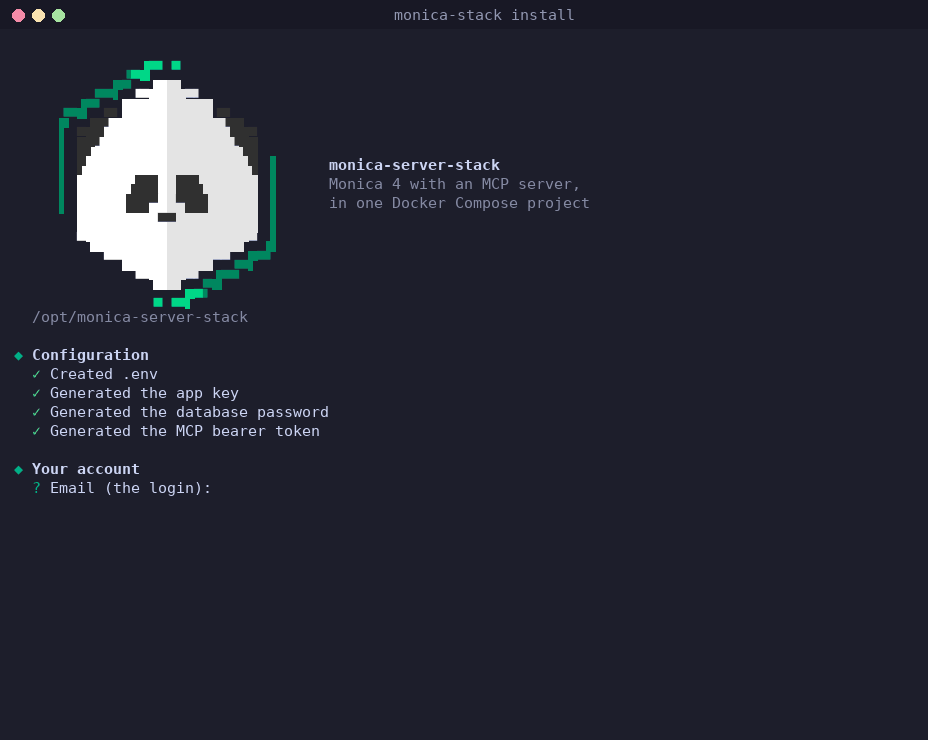

<p align="center">
  <picture>
    <source media="(prefers-color-scheme: dark)" srcset="assets/logo-dark.gif">
    
  </picture>
</p>

<h1 align="center">Monica Server Stack</h1>

<p align="center">Self-hosted <a href="https://www.monicahq.com">Monica</a> 4 with an <a href="https://github.com/Jacob-Stokes/monica-mcp">MCP server</a>, in one Docker Compose project.</p>

<p align="center">
  <a href="https://github.com/Jacob-Stokes/monica-server-stack/actions/workflows/e2e.yml"></a>
</p>

> The MCP server is [monica-mcp](https://github.com/Jacob-Stokes/monica-mcp), which also runs on its own against any Monica 4 instance, including monicahq.com.

| Service | |
|---|---|
| `monica` | Monica 4.1.2, the classic version's latest release (pinned) |
| `monica-cron` | Monica's scheduler, which sends reminders. Often missing from Monica setups, leaving reminders that never arrive. |
| `monica-db` | MariaDB 11.4 |
| `monica-setup` | Runs once on each start. Creates the first account and the MCP server's API token if they don't exist yet, and renews the token before it expires. |
| `monica-mcp` | [monica-mcp](https://github.com/Jacob-Stokes/monica-mcp): 14 tools for contacts, notes, activities, reminders and more, over Streamable HTTP with a bearer token (OAuth optional) |
| `caddy`, `tailscale` or `cloudflared` | Optional HTTPS: Monica at the domain's root, the MCP server at `/mcp` |

Handled automatically: the first account, the MCP server's API token (created, and renewed before its one-year expiry), the reminder scheduler, and an API rate limit high enough for AI clients (Monica's default is 60 a minute).

## Install

Requires Linux with Docker and Compose 2.24 or newer.

```bash
git clone https://github.com/Jacob-Stokes/monica-server-stack.git
cd monica-server-stack
./install.sh
```

<p align="center">
  
</p>

The installer asks for the account (email, name, password), timezone and currency, how to reach Monica (this machine only, a domain with HTTPS, Tailscale, a Cloudflare Tunnel, or an existing reverse proxy), and optional email settings for reminders. It writes `.env`, starts everything with `docker compose up -d`, and prints Monica's address and the MCP server's endpoint. It also offers to put a `monica-stack` command on the PATH.

**Without the installer**, the same in plain Compose: copy `.env.example` to `.env`, fill in the secrets (the file says how to generate them) and the account, then

```bash
docker compose up -d
```

The setup container creates the account and the API token on the first start. Both routes give the same compose project, so `monica-stack` can manage either.

## Connecting AI tools

The MCP server listens on `127.0.0.1:7011` (`/mcp`), or at `https://<domain>/mcp` with an HTTPS option. Clients send `Authorization: Bearer <token>`; `monica-stack endpoint --show-token` prints the token. For clients that log in with OAuth 2.1, set `MCP_OAUTH_ISSUER`, `MCP_OAUTH_CANONICAL_URL` and `MCP_OAUTH_AUDIENCE` in `.env`. The tools are described in [monica-mcp's README](https://github.com/Jacob-Stokes/monica-mcp#what-it-does).

## Managing

| Command | Does |
|---|---|
| `monica-stack status` | Containers, the MCP server, and whether Monica accepts its API token |
| `monica-stack logs [service] [-f]` | Logs: `monica`, `cron`, `db`, `setup`, `mcp`, … |
| `monica-stack restart [service]` | Restart one service, or everything |
| `monica-stack endpoint [--show-token]` | The MCP server's address and bearer token |
| `monica-stack token` | Replace the MCP server's API token (it picks up the new one without a restart) |
| `monica-stack backup [file]` | Database, files and `.env` in one archive, in `backups/` |
| `monica-stack restore <file>` | Put a backup back |
| `monica-stack update` | `git pull`, new images, rebuild and restart |
| `monica-stack uninstall` | Remove the containers; data is kept unless chosen |

Or plain Compose in the folder: `docker compose ps`, `logs`, `up -d`, `down`.

All data is in `data/`: the database (`data/db`), Monica's files (`data/storage`), the API token (`data/mcp`), and HTTPS state. Moving to another server is copying the folder, or a backup and a restore. A backup includes `.env` and so the app key, which Monica's encrypted data needs: keep backups private.

## HTTPS

| Option | Needs | Address |
|---|---|---|
| Caddy | A domain pointing at the server, ports 80 and 443 | `https://<domain>` |
| Tailscale | A Tailscale auth key | `https://<name>.<tailnet>.ts.net`, private to the tailnet |
| Cloudflare Tunnel | A tunnel token; its routes set in Cloudflare (`monica:80`, and `monica-mcp:8080` for `/mcp`) | `https://<domain>` |
| Existing reverse proxy | Proxy to `MONICA_BIND` (`127.0.0.1:8080`) and `/mcp` to `MCP_BIND` (`127.0.0.1:7011`) | Its domain |

The installer sets `COMPOSE_PROFILES` and `APP_URL`; Monica builds its links from `APP_URL`, so it has to match the address people use.

## Updating

`monica-stack update` pulls this repository and rebuilds. Monica stays on 4.1.2 until a pin in `compose.yml` changes, as Monica 4's last stable release; Monica 5 is a separate rewrite, still in beta, with a different API. [Renovate](https://docs.renovatebot.com) proposes new versions of the pinned images and of monica-mcp, each tested by the end-to-end test.

## Local changes

Additions for one server (an extra network, another port, labels) go in `compose.override.yml` next to `compose.yml`: Compose merges it automatically, git ignores it, and `monica-stack update` leaves it alone. Monica settings that `compose.yml` doesn't pass go in `monica.env` (see [Monica's `.env.example`](https://github.com/monicahq/monica/blob/4.x/.env.example)).

## Running a second copy

Set `INSTANCE_PREFIX` (e.g. `test-`) and different `MONICA_BIND` and `MCP_BIND` in its `.env`; its containers get the prefix and its command is `monica-stack-test`.

## Testing

[`scripts/test-e2e.sh`](scripts/test-e2e.sh) runs in CI. It does the following:
- installs with plain Compose;
- runs every monica-mcp tool against the result;
- checks the CLI: status, token replacement, and backup and restore;
- installs again with the installer, non-interactively;
- uninstalls.

It leaves nothing behind.

## License

MIT, for this repository. Monica (AGPL-3.0), MariaDB (GPL-2.0) and the other images are used as published, unmodified; see [THIRD_PARTY_NOTICES.md](THIRD_PARTY_NOTICES.md).
